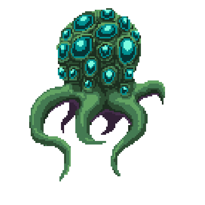
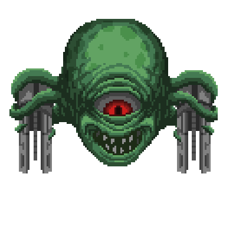
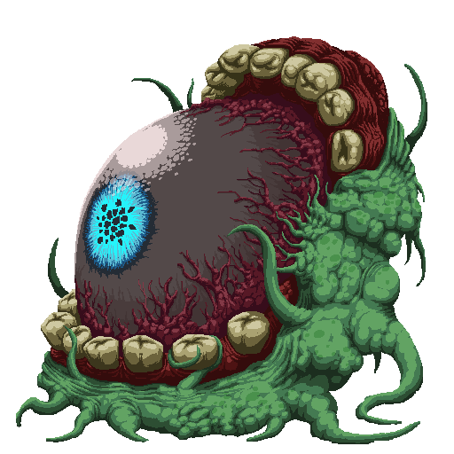
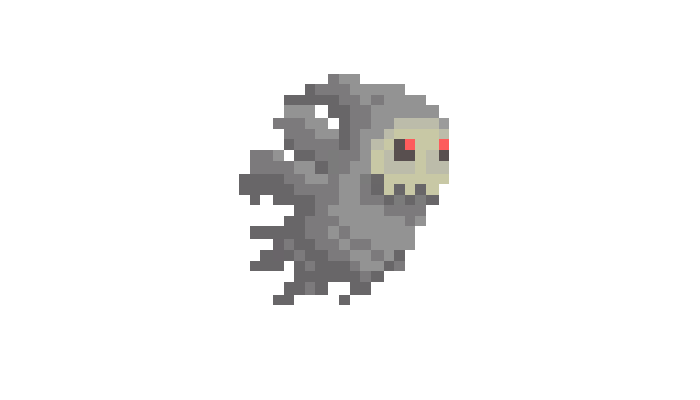

# VibeGaming - Hand Gesture Weapon Combat

Trò chơi chiến đấu 2D pixel art sử dụng thị giác máy tính, nơi người chơi điều khiển vũ khí bằng cử chỉ tay thật trước camera.

## Công cụ và công nghệ sử dụng


### Vai trò của từng công cụ

- Python: ngôn ngữ chính để xây dựng toàn bộ hệ thống game.
- Pygame: dựng giao diện, sprite, hiệu ứng và gameplay thời gian thực.
- MediaPipe HandLandmarker: nhận diện bàn tay và 21 landmark trong video.
- OpenCV: xử lý ảnh camera, lật khung hình, optical flow và hỗ trợ theo dõi chuyển động.
- NumPy: tính toán vector, tốc độ, góc và các ngưỡng nhận diện cử chỉ.

## Cốt truyện

Nhân loại đang đối mặt với làn sóng xâm lăng từ quái vật ngoài không gian. Bạn vào vai một anh hùng chiến đấu tuyến đầu, sử dụng công nghệ nhận diện cử chỉ để triệu hồi vũ khí theo thời gian thực. Mỗi loại quái vật cần một chiến thuật khác nhau, vì vậy bạn phải đổi vũ khí linh hoạt ngay trong giao tranh, tận dụng tốc độ tay và độ chính xác của từng động tác để giành chiến thắng.

## Các loại vũ khí và cách sử dụng

Lưu ý: camera được lật gương ngang, vì vậy nhãn tay từ MediaPipe bị đảo so với tay thật của người chơi.

### 1. Iron Gauntlets (Găng tay sắt)

- Trang bị: đưa cả hai tay vào khung hình, nắm đấm cả hai tay, giữ tư thế boxing với khoảng cách hai tay đủ xa trong khoảng 0.35 giây.
- Tấn công: đẩy tay nhanh về phía camera để kích hoạt cú đấm.
- Đặc điểm: sát thương cận chiến vùng tròn, phù hợp áp sát.

### 2. Sword (Kiếm)

- Trang bị giai đoạn 1: hai tay nắm đấm, đưa gần nhau và ngang hàng theo trục Y.
- Trang bị giai đoạn 2: kéo hai tay ra xa rồi giữ đủ thời gian kích hoạt.
- Tấn công: chém bằng cách di chuyển tay nhanh, hệ thống nhận hướng chém theo vector vận tốc.
- Đặc điểm: có trail chém duy trì ngắn hạn để gây sát thương liên tục.

### 3. Bow (Cung)

- Trang bị giai đoạn 1: hai tay nắm đấm, đưa gần nhau nhưng lệch cao độ theo trục Y.
- Trang bị giai đoạn 2: kéo hai tay ra xa và giữ để kích hoạt.
- Sử dụng: một tay giữ cung, tay còn lại kéo dây để tăng lực bắn; mở tay hoặc thực hiện chuyển động snap để nhả tên.
- Đặc điểm: tốc độ và sát thương mũi tên tỉ lệ theo mức kéo dây.

### 4. Grenade (Lựu đạn)

- Trang bị: chỉ đưa một tay vào khung hình, nắm đấm và giữ khoảng 0.35 giây.
- Tấn công: mở tay kết hợp chuyển động ném nhanh để ném lựu đạn theo hướng tay.
- Đặc điểm: nổ diện rộng sau quãng bay ngắn hoặc khi chạm điều kiện kích nổ.

### 5. Gun (Súng)

- Trang bị: cả hai tay vào khung hình, ngón trỏ và ngón giữa duỗi thẳng, các ngón còn lại co lại, giữ đủ thời gian.
- Tấn công: chuyển trạng thái từ tay mở sang nắm để bắn từng phát.
- Đặc điểm: không tự bắn liên tục khi giữ nguyên tư thế, cần thao tác chuyển trạng thái rõ ràng.

### 6. Mine (Mìn)

- Trang bị: cả hai tay vào khung hình, ngón cái và ngón trỏ duỗi tạo hình chữ L, đưa hai đầu ngón cái chạm gần nhau và giữ.
- Tấn công: giữ cử chỉ thêm một khoảng ngắn để đặt mìn tại vị trí nhân vật.
- Đặc điểm: mìn có ngòi nổ, gây sát thương lớn diện rộng và hất văng mục tiêu.

## Hình ảnh minh họa vũ khí

| Vũ khí | Hình minh họa |
|---|---|
| Iron Gauntlets |  |
| Sword |  |
| Bow |  |
| Grenade |  |
| Gun |  |
| Mine |  |

## Hình ảnh minh họa quái vật

| Quái vật | Hình minh họa |
|---|---|
| Blob Alien |  |
| Alien Firing |  |
| Boss Alien |  |
| Monster |  |

## Các màn chơi

Hệ thống màn chơi đi theo chu trình sau:

1. Loading Screen: khởi tạo tài nguyên, model nhận diện và thành phần gameplay.
2. Training Room (Checking Weapon): khu vực làm quen cử chỉ, kiểm tra trang bị vũ khí.
3. Playing: màn chiến đấu chính với quái vật và quản lý sinh tồn.
4. Game Over: hiển thị khi máu nhân vật về 0.
5. Restart: nhấn phím R để vào lại vòng chơi.

## Luồng điều khiển chính

Camera (640x480) -> Lật gương ngang -> Nhận diện landmark tay -> Phân loại cử chỉ -> Logic game -> Render Pygame (1920x1080)

## Hướng dẫn chạy nhanh

1. Cài đặt thư viện:

```bash
pip install -r requirements.txt
```

2. Chạy game:

```bash
python main.py
```

3. Khuyến nghị khi chơi:

- Giữ môi trường đủ sáng.
- Dùng nền đơn giản để giảm nhiễu nhận diện.
- Đặt camera cách người chơi khoảng 50-80 cm để theo dõi tay ổn định.